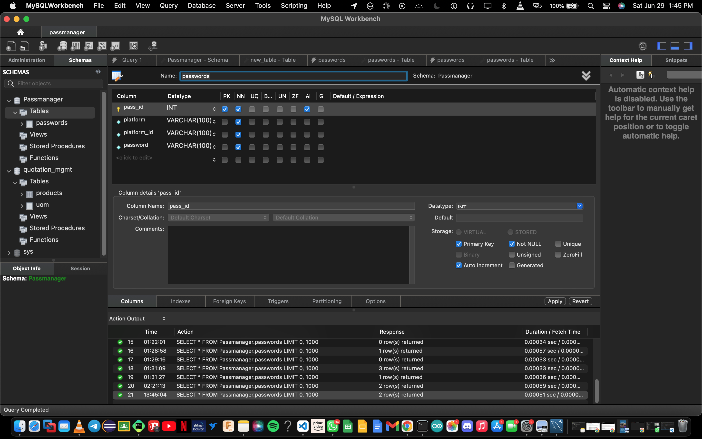
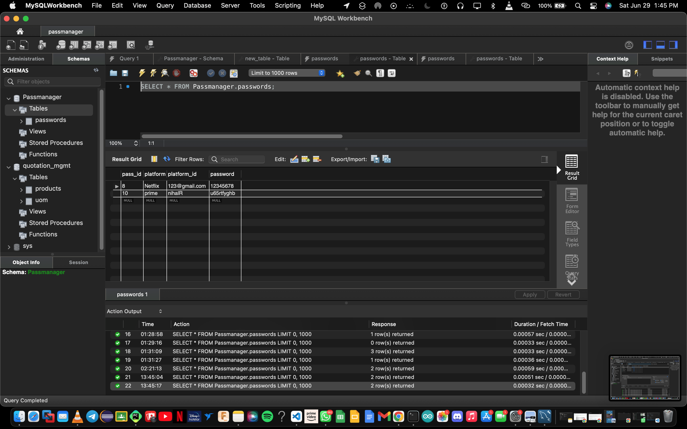

# password-manager

Download mysql for windows: https://dev.mysql.com/downloads/installer/
Create table is my sql workbench, table specifications:
  table name:passwords
  columns: 4 (pass_id,platform,platform_id,password)
  

  pass_id:primary key,auto increment,not null
  platform:not null
  platform_id:not null
  password:not null

  
  
  
  

In python environment please install:
 pip install flask
 pip install mysql-connector-python

